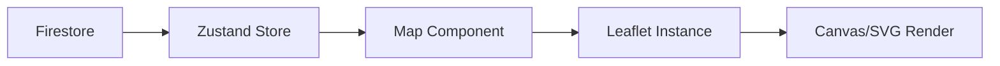

# 地図機能技術要件書

**文書バージョン**: 1.0.0  
**最終更新日**: 2025-08-21  
**ステータス**: Draft

## 1. 概要

### 1.1 目的
Fieldwork Activity Trackerアプリケーションにおける地図表示および軌跡表示機能の技術要件を定義する。

### 1.2 スコープ
- 地図表示基盤
- GPX軌跡の可視化
- ユーザーインタラクション
- パフォーマンス最適化
- 将来の拡張性

### 1.3 用語定義
| 用語 | 定義 |
|------|------|
| GPX | GPS Exchange Format - GPS軌跡データの標準フォーマット |
| タイル | 地図を構成する256x256ピクセルの画像単位 |
| ベクタータイル | 画像ではなくベクターデータとして配信される地図タイル |
| SSR | Server-Side Rendering - サーバーサイドレンダリング |
| CSR | Client-Side Rendering - クライアントサイドレンダリング |

## 2. 技術スタック

### 2.1 現在の構成
```
├── 地図エンジン: Leaflet 1.9.4
├── フレームワーク: Next.js 15.5.0
├── 状態管理: Zustand 5.0.8
├── データストア: Firebase Firestore
└── スタイリング: Tailwind CSS 3.4.17
```

### 2.2 依存関係
```json
{
  "dependencies": {
    "leaflet": "^1.9.4",
    "@types/leaflet": "^1.9.20"
  }
}
```

## 3. 機能要件

### 3.1 基本機能要件

#### 3.1.1 地図表示
- **要件ID**: MAP-001
- **優先度**: 必須
- **説明**: OpenStreetMapタイルを使用した基本地図表示

```typescript
interface MapDisplayRequirements {
  initialCenter: [number, number];  // [35.6762, 139.6503] 東京
  initialZoom: number;              // 6
  minZoom: number;                  // 3
  maxZoom: number;                  // 18
  tileProvider: string;             // OpenStreetMap
}
```

#### 3.1.2 GPX軌跡表示
- **要件ID**: MAP-002
- **優先度**: 必須
- **説明**: 複数のGPX軌跡を同時に表示

```typescript
interface TrackDisplayRequirements {
  maxTracks: number;           // 20
  lineWeight: number;          // 3px
  lineOpacity: number;         // 0.7
  colorScheme: 'auto' | 'manual';
  simplification: boolean;     // ポイント簡素化
}
```

#### 3.1.3 マーカー表示
- **要件ID**: MAP-003
- **優先度**: 必須
- **説明**: 開始点・終了点のマーカー表示

```typescript
interface MarkerRequirements {
  startMarker: boolean;
  endMarker: boolean;
  waypointMarkers: boolean;
  customIcons: boolean;
  clustering: boolean;  // Phase 2
}
```

### 3.2 インタラクション要件

#### 3.2.1 地図操作
- **要件ID**: INT-001
- **優先度**: 必須

| 操作 | デスクトップ | モバイル |
|------|-------------|----------|
| パン | ドラッグ | スワイプ |
| ズーム | スクロール/ボタン | ピンチ/ボタン |
| 軌跡選択 | クリック | タップ |

#### 3.2.2 ポップアップ表示
- **要件ID**: INT-002
- **優先度**: 必須

```typescript
interface PopupContent {
  activityTitle: string;
  date: Date;
  distance: number;
  duration: number;
  elevationGain: number;
}
```

### 3.3 拡張機能要件

#### 3.3.1 標高プロファイル
- **要件ID**: EXT-001
- **優先度**: 高
- **ステータス**: 未実装

```typescript
interface ElevationProfile {
  chartType: 'line' | 'area';
  xAxis: 'distance' | 'time';
  yAxis: 'elevation';
  gradient: boolean;  // 勾配表示
}
```

#### 3.3.2 地図スタイル切替
- **要件ID**: EXT-002
- **優先度**: 中
- **ステータス**: 未実装

```typescript
enum MapStyle {
  STANDARD = 'OpenStreetMap',
  TERRAIN = '地理院地形図',
  SATELLITE = '衛星写真',
  TOPO = 'OpenTopoMap'
}
```

#### 3.3.3 オフライン対応
- **要件ID**: EXT-003
- **優先度**: 低
- **ステータス**: 未実装

## 4. 非機能要件

### 4.1 パフォーマンス要件

#### 4.1.1 レスポンスタイム
| 操作 | 目標時間 | 最大許容時間 |
|------|----------|-------------|
| 初期表示 | < 2秒 | 5秒 |
| 軌跡追加 | < 500ms | 2秒 |
| ズーム/パン | < 100ms | 500ms |

#### 4.1.2 メモリ使用量
```typescript
interface MemoryConstraints {
  maxMemoryUsage: '200MB';
  maxGPXPoints: 10000;  // 簡素化前
  maxSimplifiedPoints: 1000;  // 簡素化後
  maxConcurrentTracks: 20;
}
```

#### 4.1.3 軌跡簡素化アルゴリズム
```typescript
// Ramer-Douglas-Peuckerアルゴリズム実装
function simplifyTrack(points: GPXPoint[], tolerance: number): GPXPoint[] {
  if (points.length <= 2) return points;
  
  // 動的許容誤差
  const dynamicTolerance = tolerance * Math.pow(2, 15 - zoomLevel);
  
  // 再帰的簡素化
  return douglasPeucker(points, dynamicTolerance);
}
```

### 4.2 信頼性要件

#### 4.2.1 エラーハンドリング
```typescript
interface ErrorHandling {
  tileLoadError: () => void;      // タイル読込失敗
  gpxParseError: () => void;      // GPX解析失敗
  renderError: () => void;        // 描画エラー
  networkError: () => void;       // ネットワークエラー
}
```

#### 4.2.2 フォールバック
- タイル読込失敗 → デフォルトタイル表示
- 地図初期化失敗 → 静的画像表示
- GPX解析失敗 → エラーメッセージ表示

### 4.3 ユーザビリティ要件

#### 4.3.1 レスポンシブデザイン
```css
/* デスクトップ */
.map-container {
  height: 600px;
}

/* タブレット */
@media (max-width: 1024px) {
  .map-container {
    height: 500px;
  }
}

/* モバイル */
@media (max-width: 768px) {
  .map-container {
    height: 400px;
  }
}
```

#### 4.3.2 アクセシビリティ
- キーボードナビゲーション対応
- スクリーンリーダー対応
- 高コントラストモード対応
- WCAG 2.1 Level AA準拠

### 4.4 セキュリティ要件

#### 4.4.1 データ保護
- APIキーの環境変数管理
- XSS対策（HTMLエスケープ）
- CORS設定の適切な管理

#### 4.4.2 プライバシー
- 位置情報の暗号化
- 個人識別情報の除去
- GDPRコンプライアンス

## 5. 技術アーキテクチャ

### 5.1 コンポーネント構成
```
components/
├── map-component.tsx        # 地図本体
├── activity-map-dynamic.tsx # 動的インポートラッパー
├── elevation-profile.tsx    # 標高グラフ (Phase 2)
└── map-controls.tsx        # 地図コントロール (Phase 2)
```

### 5.2 データフロー


### 5.3 SSR/CSR戦略
```typescript
// Dynamic Import設定
const MapComponent = dynamic(
  () => import('./map-component'),
  {
    ssr: false,  // SSR無効化
    loading: () => <MapSkeleton />
  }
);
```

## 6. 実装フェーズ

### Phase 1: 基礎機能強化（2週間）
- [x] 基本地図表示
- [x] GPX軌跡表示
- [ ] 軌跡簡素化アルゴリズム
- [ ] エラーハンドリング強化
- [ ] レスポンシブ対応改善

### Phase 2: UX向上（1ヶ月）
- [ ] 標高プロファイル表示
- [ ] 地図スタイル切替
- [ ] 軌跡フィルタリング
- [ ] パフォーマンス最適化
- [ ] アクセシビリティ対応

### Phase 3: 高度な機能（2-3ヶ月）
- [ ] オフライン対応
- [ ] 3D地形表示（Mapbox検討）
- [ ] リアルタイム追跡
- [ ] ソーシャル機能
- [ ] 高度な統計分析

## 7. テスト要件

### 7.1 単体テスト
```typescript
describe('MapComponent', () => {
  test('地図初期化', () => {});
  test('軌跡描画', () => {});
  test('マーカー配置', () => {});
  test('ポップアップ表示', () => {});
});
```

### 7.2 統合テスト
- Firestore連携テスト
- 状態管理テスト
- エラーハンドリングテスト

### 7.3 パフォーマンステスト
- 1000ポイント軌跡表示
- 20軌跡同時表示
- メモリリーク検証

### 7.4 ブラウザ互換性テスト
- Chrome 90+
- Firefox 88+
- Safari 14+
- Edge 90+
- Mobile Safari (iOS 14+)
- Chrome Mobile (Android 10+)

## 8. 監視・運用

### 8.1 パフォーマンスメトリクス
```typescript
interface PerformanceMetrics {
  mapLoadTime: number;      // 目標 < 2s
  tileLoadTime: number;     // 目標 < 500ms
  renderTime: number;       // 目標 < 100ms
  memoryUsage: number;      // 目標 < 200MB
  errorRate: number;        // 目標 < 1%
}
```

### 8.2 ログ収集
- エラーログ
- パフォーマンスログ
- ユーザー操作ログ

## 9. 将来の検討事項

### 9.1 Mapbox移行検討
**移行条件**:
- MAU > 1,000
- 3D地形が必須要件
- 月額$100以上の予算確保

### 9.2 機能拡張候補
- AR表示
- 音声ナビゲーション
- AIによる経路推薦
- 天気情報オーバーレイ

## 10. リファレンス

### 10.1 外部ドキュメント
- [Leaflet Documentation](https://leafletjs.com/reference.html)
- [OpenStreetMap Tile Usage Policy](https://operations.osmfoundation.org/policies/tiles/)
- [GeoJSON Specification](https://geojson.org/)
- [GPX Schema](https://www.topografix.com/GPX/1/1/)

### 10.2 関連仕様書
- Firebase設計書
- API仕様書
- UI/UXガイドライン

## 改訂履歴

| バージョン | 日付 | 変更内容 | 作成者 |
|-----------|------|----------|--------|
| 1.0.0 | 2025-08-21 | 初版作成 | Claude |

---
*このドキュメントは定期的に更新されます。最新版は[GitHub](https://github.com/comomo25/fieldwork-activity-tracker)を参照してください。*